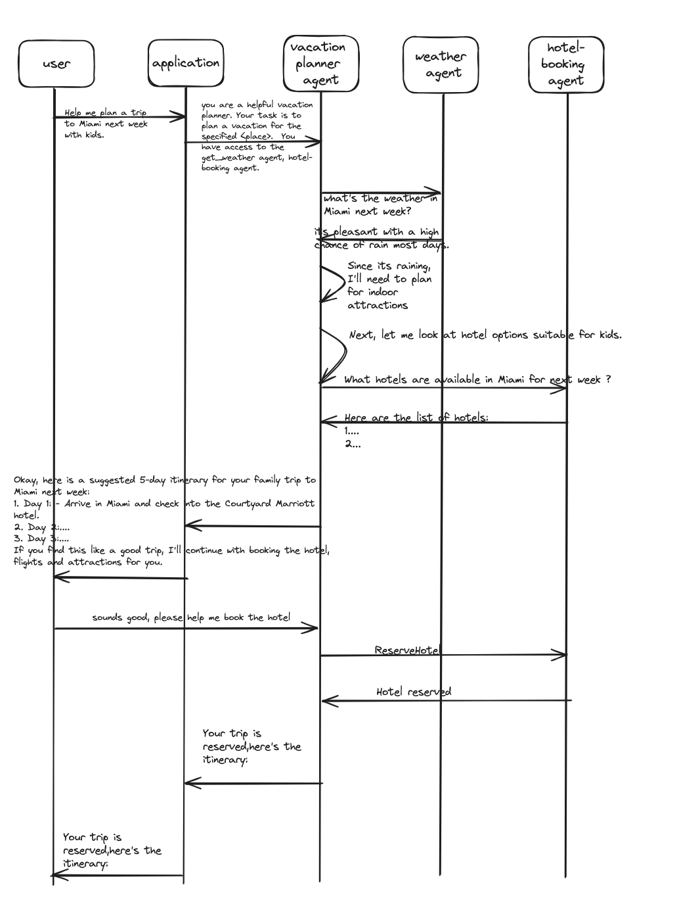
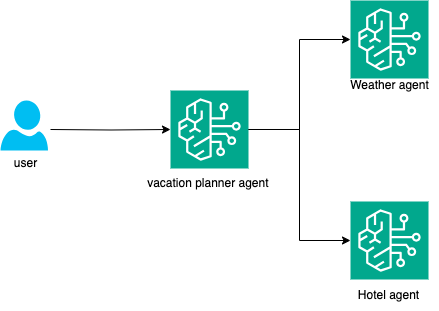

# vacation-planner using multiple Bedrock agents

This project contains source code and supporting files for a vacation planner GenAI based application. the vacation planner is an AI agent that can collaborate with other AI agents like the weather agent and the hotel agent to suggest a vacation plan for users. The vacation planner agent can check for the wether predictions using the weather agent and suggest hotels in the destination using the hotel agent. It can further help with reseving hotels ( when the hotel agent supports reserving hotels). The entire application is serverless and can be deployed using SAM CLI. It includes the following files and folders.

- hotel-agent - This is the hotel agent that can use its tools to get a list of hotels in a city. When enhanced it can lookup availability and make reservations.
- planner-agent - Invocation events that you can use to invoke the function.
- weather-agent - This is the weather agent that can use its weather tool(lambda function) to fetch weather predictions for a city.
- template.yaml - A template that defines the application's AWS resources. This helps create all the agents listed above with their lambda functions.

## Architecture

Here's the flow of events in a conversation.



Here's the architecture diagram using Bedrock agents.



## Deploy the sample application

To use the SAM CLI, you need the following tools.

- SAM CLI - [Install the SAM CLI](https://docs.aws.amazon.com/serverless-application-model/latest/developerguide/serverless-sam-cli-install.html)
- [Python 3 installed](https://www.python.org/downloads/)
- Docker - [Install Docker community edition](https://hub.docker.com/search/?type=edition&offering=community)

Create the boto3 lambda layer with the latest boto3 version compatible with python 3.10 and above. Name the boto3 layer as latest-boto3. For instructions, follow: https://github.com/jeromevdl/boto3-lambda-layer

Then build this application.
To build and deploy the application for the first time, run the following in your shell:

```bash
sam build --use-container
sam deploy --guided
```

## Test the sample application

## Cleanup

To delete the sample application that you created, use the AWS CLI. Assuming you used your project name for the stack name, you can run the following:

```bash
sam delete --stack-name "vacation-planner"
```

## Resources
